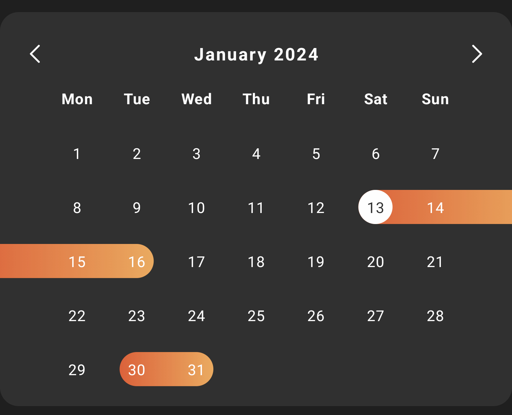

# Compose Calendar with selections


[](https://central.sonatype.com/artifact/io.github.dimitarstoyanoff/calendar)
[](https://voicelip.com/)

Calendar view made with Jetpack Compose which supports adding selection ranges, displaying them with an animation, moving between months, and a loading view.

Used in the [Voicelip](https://play.google.com/store/apps/details?id=com.voicelip) Android app.


<!--  -->

## Setup
Library is available on Maven Central repository.
```kotlin
    // module-level build.gradle
    dependecies {
        implementation("io.github.dimitarstoyanoff:calendar:<latest-version>")
    }
```

If your app module has a minSdk < 26, you also need to add [code desugaring](https://developer.android.com/studio/write/java8-support) to your module:

```kotlin
    android {
    compileOptions {
            isCoreLibraryDesugaringEnabled = true
            sourceCompatibility = JavaVersion.VERSION_1_8
            targetCompatibility = JavaVersion.VERSION_1_8
        }
    }

    dependecies {
        // ...
        coreLibraryDesugaring("com.android.tools:desugar_jdk_libs:<latest-version>")
    }
```

## Usage

### Displaying the calendar

To just display the calendar you can use the following:

```kotlin
    CalendarView(
        Modifier.wrapContentSize(),
        currentMonth = calendarViewModel.currentMonth,
        calendarRangesState = calendarViewModel.calendarActivity.observeAsState(),
        currentMonthTitleProvider = { calendarViewModel.getCurrentMonthTitle() },
        onPreviousClick = { calendarViewModel.previousMonthClicked() },
        onNextClick = { calendarViewModel.nextMonthClicked() }
    )
```

### ViewModel logic

It is recommended that the data shown on the calendar is stored in its own ViewModel. There it can be easily managed and persisted. You can use your own implementation, or subclass `CalendarViewModel` and reuse some of its functionality. Then you can use the following setup:

```kotlin
    override fun fetchNewYearCalendarActivity(year: Int) {
        viewModelScope.launch {
            calendarActivity.value = CalendarViewUiState.Loading
            // Setting example data.
            calendarUiStates = listOf(
                CalendarUiState(LocalDate.now(), LocalDate.now().plusDays(3))
            )
            // Updating the UI.
            calendarActivity.value = 
                CalendarViewUiState.Success(filterMonthRanges(calendarUiStates, currentMonth.value.yearMonth))
        }
    }
```

Check out the sample project for more details.

## License

    Copyright 2023 dimitarstoyanoff.

    Licensed under the Apache License, Version 2.0 (the "License");
    you may not use this file except in compliance with the License.
    You may obtain a copy of the License at

       http://www.apache.org/licenses/LICENSE-2.0

    Unless required by applicable law or agreed to in writing, software
    distributed under the License is distributed on an "AS IS" BASIS,
    WITHOUT WARRANTIES OR CONDITIONS OF ANY KIND, either express or implied.
    See the License for the specific language governing permissions and
    limitations under the License.
